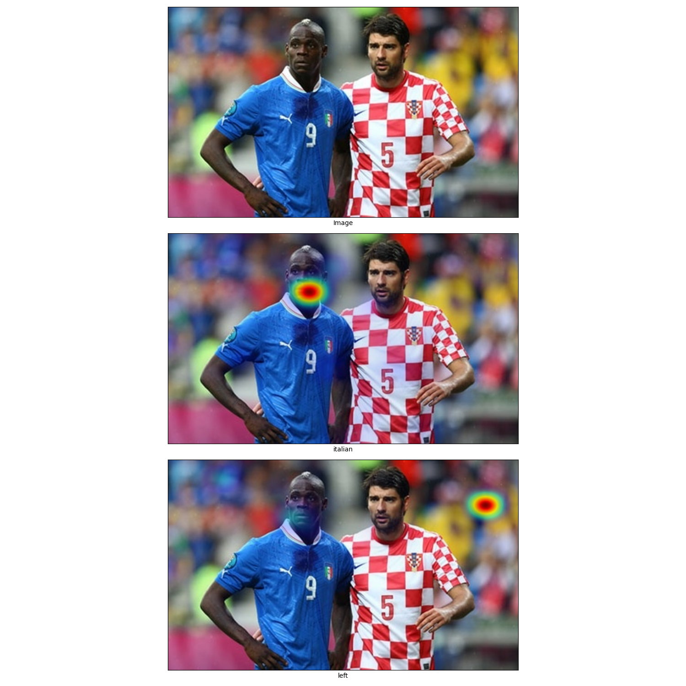

# VisualizationForAttentionMAp
It's a simple way for us to visualizaiton the cross attention between image and text. Futhermore, you can use it to visualize your attention framework by switching the model to yours.

## visualization

  

## Reference
@inproceedings{ALBEF,
      title={Align before Fuse: Vision and Language Representation Learning with Momentum Distillation}, 
      author={Junnan Li and Ramprasaath R. Selvaraju and Akhilesh Deepak Gotmare and Shafiq Joty and Caiming Xiong and Steven Hoi},
      year={2021},
      booktitle={NeurIPS},
}
